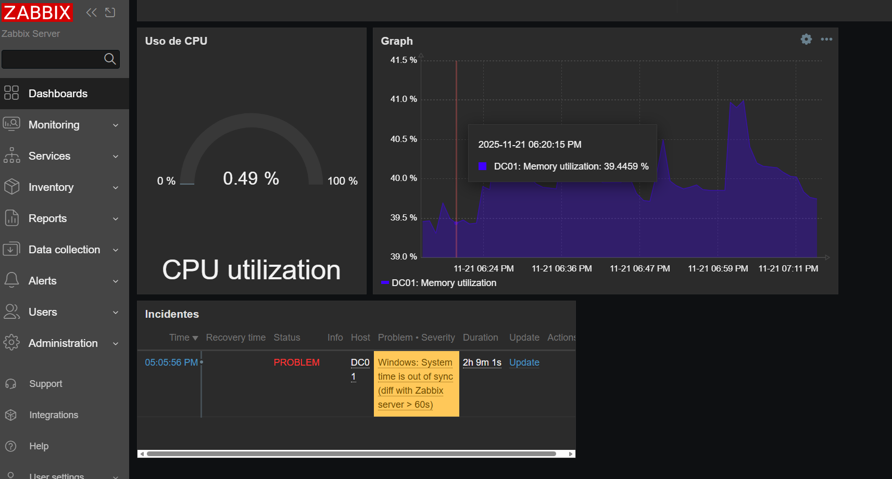
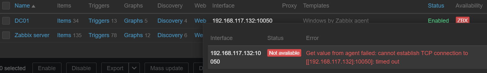
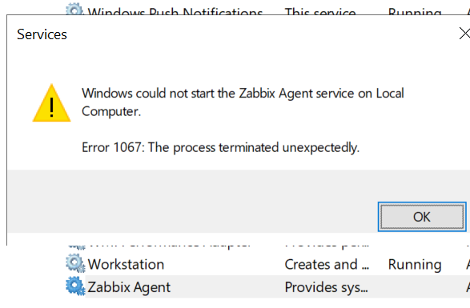
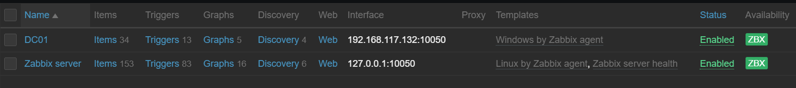

# 📊 Projeto: Implementação de Monitoramento com Zabbix 7.0

> 🚧 **Status do Projeto:** Em andamento (Fase atual: Criação de Triggers personalizados)

## 📑 Sumário
1. [Objetivo](#-objetivo)
2. [Arquitetura do Ambiente](#-arquitetura-do-ambiente)
3. [Stack Tecnológica](#-stack-tecnológica)
4. [Documentação Técnica (Docs)](#-documentação-técnica)
5. [Etapas Realizadas](#-etapas-realizadas)
6. [Dashboards Personalizados](#-dashboards-personalizados)
7. [Desafios e Troubleshooting](#-desafios-e-troubleshooting)
8. [Próximos Passos](#-próximos-passos-roadmap)
9. [Comandos Importantes](#-comandos-importantes)

## 🎯 Objetivo
Configurar um ambiente de monitoramento de infraestrutura "do zero", simulando um cenário corporativo real. O objetivo é garantir a observabilidade de servidores e serviços, permitindo ação proativa antes de falhas críticas.

## 🏗️ Arquitetura do Ambiente

```plaintext
Windows Host (PowerShell)
        │
   SSH / NAT
        │
Ubuntu Server VM ─── Zabbix Server 7.0
        │
     MariaDB
        │
 Interface Web (Apache)
```


## 🛠️ Stack Tecnológica
* **Hypervisor:** VMware Workstation Pro 
* **Sistema Operacional:** Linux Ubuntu Server 24.04 LTS
* **Monitoramento:** Zabbix Server 7.0 LTS
* **Banco de Dados:** MariaDB 10.11
* **Web Server:** Apache
* **Acesso Remoto:** SSH


## 📚 Documentação Técnica

1. **[Instalação do Zabbix Server no Linux](docs/01-instalacao-ubuntu-zabbix.md)**
   * Comandos utilizados no terminal.
   * Configuração do MariaDB.
   * Ajustes de firewall e SSH.


## 🚀 Etapas Realizadas

### 1. Provisionamento do Servidor (Linux)
Instalação limpa do **Ubuntu Server 24.04** via CLI para otimização de recursos. Configuração de rede em modo *NAT* para comunicação com a rede externa.

### 2. Acesso e Gerenciamento Remoto
Configuração do serviço SSH para administração remota via PowerShell.


*(Acesso via SSH confirmando conectividade entre Windows e Linux)*

### 3. Instalação e Configuração do Backend
* Instalação dos pacotes do repositório oficial Zabbix 7.0.
* Configuração do Banco de Dados **MariaDB**: Criação de usuário dedicado e importação do esquema inicial de tabelas.
* Ajuste de arquivos de configuração (`zabbix_server.conf`) via editor Nano.

### 4. Resultado da Instalação e configuração
O servidor está operacional, com o serviço de backend rodando e a interface web acessível. O monitoramento "Self-check" (Zabbix server monitorando a si mesmo) está ativo e verde.


*(Dashboard em Global View do Zabbix)*


*(Status do servidor)*

### 5. Integração com Windows Server (Active Directory)
Instalação do Zabbix Agent no servidor Windows (Domain Controller).
* **Arquitetura de Rede:** Configuração de **Dual NIC** no Windows (uma interface LAN para o AD e uma NAT para o Zabbix/Internet) garantindo isolamento do domínio e também conectividade para o monitoramento.
* **Segurança:** Configuração de regras de entrada (Inbound Rules) no Windows Firewall para a porta 10050.

## 📊 Dashboards Personalizados

Além da configuração de backend, foram criados painéis visuais simulando ambiente NOC (Network Operations Center) visando o monitoramento em tempo real de recursos críticos do Active Directory.


*(Dashboards configurados: Monitoramento de CPU, Histórico de Memória e Alertas de Incidentes)*


## 🔧 Desafios e Troubleshooting

Durante a implementação do Agente no Windows Server, foi constatado problema na conexão entre o Zabbix Agent e o lab de Windows Server. Na interface web, a aba "Hosts" apontou o Status de "Availability" do Windows Server em vermelho, cConstatado erro na conexão TCP conforme print abaixo:


*(Status em vermelho, falha em conexão TCP > Porta 10050)*

Ao abrir `services.msc`, foi verificado que o agente não estava inicializado/ativo. Ao tentar iniciar o serviço manualmente, foi constatado erro 1067, levando a um crash silencioso.



*(Erro 1067 ao tentar iniciar)*

O problema foi verificado e resolvido da seguinte forma:

1.  **Sintoma:** O serviço `Zabbix Agent` iniciava mas era finalizado de forma repentina. Em `services.msc`, o serviço estava como `Running` mas tanto o log quanto o prompt de comando (`net stop "Zabbix Agent"`) apontava que o serviço não estava ativo. O agente também não escutava na porta 10050 (`netstat` retornava vazio).

2.  **Investigação:**
      * Confirmado que o serviço tinha permissões de escrita nas permissões NTFS.
      * Testes de rede e desativação temporária do Firewall.
      * Dentro de `zabbix_agentd.conf`, foram especificados valores em `ListenIP` (para 0.0.0.0 e também 192.168.117.132) e `ListenPort` (para 10050), sem sucesso.
      * Arquivo `zabbix_agentd.conf` salvo como UTF-8 (sem BOM).


3.  **Solução:**
    * Versão instalada anteriormente era a Zabbix agent v7.4.5.
    * Realizado downgrade / instalação limpa da versão **LTS (7.0.5)**.

4.  **Causa raiz:** Provável incompatibilidade com a versão previamente instalada (7.4.5).

5.  **Resultado:** Comunicação estabelecida com sucesso.


*(Status em verde, funcional)*

## 🔜 Próximos Passos
✅ Configurar Zabbix Agent no Windows Server (Active Directory). 

✅ Configurar Dashboards visuais para o NOC.

[  ] Criar Alertas personalizados (CPU, Disco, Serviços).

[  ] Criar Triggers personalizados para serviços críticos (ex: Print Spooler).

[  ] Configurar envio de notificações (Email/Telegram).

[  ] Explorar monitoramento via SNMP (Simulação de Rede).


## 💻 Comandos Importantes (uso pessoal)

Lista rápida de comandos para manutenção do servidor:

### Linux (Zabbix Server)
| Ação | Comando |
| :--- | :--- |
| **Verificar Status do Serviço** | `sudo systemctl status zabbix-server` |
| **Reiniciar Serviço** | `sudo systemctl restart zabbix-server` (net stop + net start do linux) |
| **Ler Logs em Tempo Real** | `sudo tail -f /var/log/zabbix/zabbix_server.log` (tail mostra as últimas linhas do arquivo, -f = follow = exibe continuamente em tempo real) |
| **Verificar config de rede** | `ip a` (ipconfig do linux) |
| **Testar Conexão com Agente** | `curl -v telnet://192.168.117.132:10050` (telnet testa conectividade TCP em uma porta específica / curl -v simula telnet mesmo não tendo instalado) |

### Windows (Zabbix Agent)
| Ação | Comando (CMD/PowerShell) |
| :--- | :--- |
| **Verificar Porta 10050 Aberta** | `netstat -ano \| findstr 10050` |
| **Encerrar serviço** | `net stop "Zabbix Agent"` |
| **Iniciar serviço** | `net start "Zabbix Agent"` |
