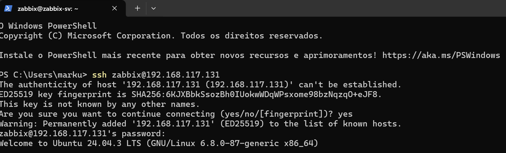
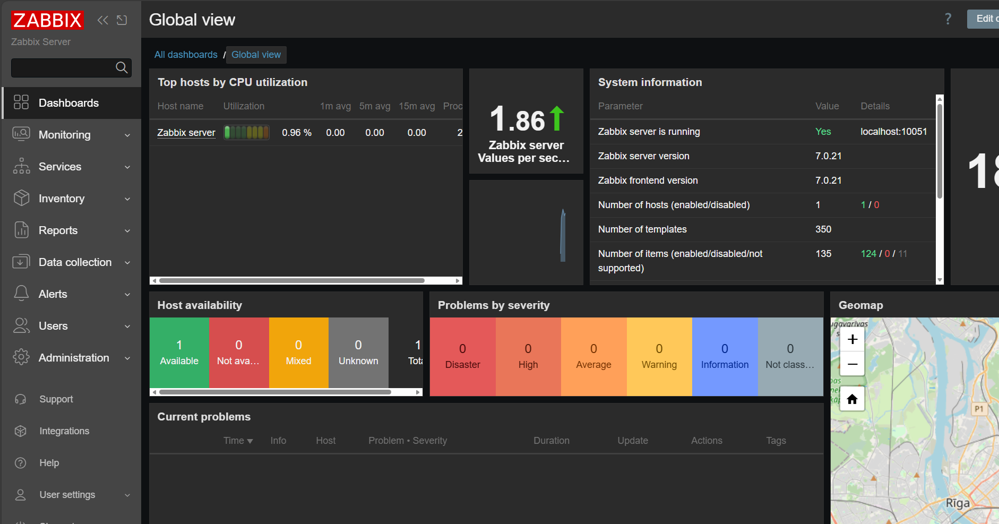
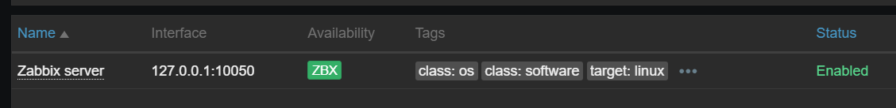

# 📊 Projeto: Implementação de Monitoramento com Zabbix 7.0

> 🚧 **Status do Projeto:** Em andamento (Fase atual: Configuração de Agentes Windows/AD)

## 📑 Sumário
1. [Objetivo](#objetivo)
2. [Arquitetura do Ambiente](#arquitetura-do-ambiente)
3. [Stack Tecnológica](#stack-tecnológica)
4. [Documentação Técnica (Docs)](#documentação-técnica)
5. [Etapas Realizadas](#etapas-realizadas)
6. [Próximos Passos](#próximos-passos-roadmap)
7. [Comandos Importantes](#comandos-importantes)

## 🎯 Objetivo
Configurar um ambiente de monitoramento de infraestrutura "do zero", simulando um cenário corporativo real. O objetivo é garantir a observabilidade de servidores e serviços, permitindo ação proativa antes de falhas críticas.

## 🏗️ Arquitetura do Ambiente

```plaintext
Windows Host (PowerShell)
        │
   SSH / NAT
        │
Ubuntu Server VM ─── Zabbix Server 7.0
        │
     MariaDB
        │
 Interface Web (Apache)
```


## 🛠️ Stack Tecnológica
* **Hypervisor:** VMware Workstation Pro 
* **Sistema Operacional:** Linux Ubuntu Server 24.04 LTS
* **Monitoramento:** Zabbix Server 7.0 LTS
* **Banco de Dados:** MariaDB 10.11
* **Web Server:** Apache
* **Acesso Remoto:** SSH


## 📚 Documentação Técnica

1. **[Instalação do Zabbix Server no Linux](docs/01-instalacao-ubuntu-zabbix.md)**
   * Comandos utilizados no terminal.
   * Configuração do MariaDB.
   * Ajustes de firewall e SSH.


## 🚀 Etapas Realizadas

### 1. Provisionamento do Servidor (Linux)
Instalação limpa do **Ubuntu Server 24.04** via CLI para otimização de recursos. Configuração de rede em modo *NAT* para comunicação com a rede externa.

### 2. Acesso e Gerenciamento Remoto
Configuração do serviço SSH para administração remota via PowerShell.


*(Acesso via SSH confirmando conectividade entre Windows e Linux)*

### 3. Instalação e Configuração do Backend
* Instalação dos pacotes do repositório oficial Zabbix 7.0.
* Configuração do Banco de Dados **MariaDB**: Criação de usuário dedicado e importação do esquema inicial de tabelas.
* Ajuste de arquivos de configuração (`zabbix_server.conf`) via editor Nano.

### 4. Resultado Final
O servidor está operacional, com o serviço de backend rodando e a interface web acessível. O monitoramento "Self-check" (Zabbix server monitorando a si mesmo) está ativo e verde.


*(Dashboard em Global View do Zabbix)*


*(Status do servidor)*

## 🔜 Próximos Passos
* Configurar Zabbix Agent no Windows Server (Active Directory).
* Criar Alertas personalizados (CPU, Disco, Serviços).
* Configurar Dashboards visuais para o NOC.


## 💻 Comandos Importantes

Lista rápida de comandos para manutenção do servidor:

| Ação | Comando |
| :--- | :--- |
| **Verificar status** | `sudo systemctl status zabbix-server` |